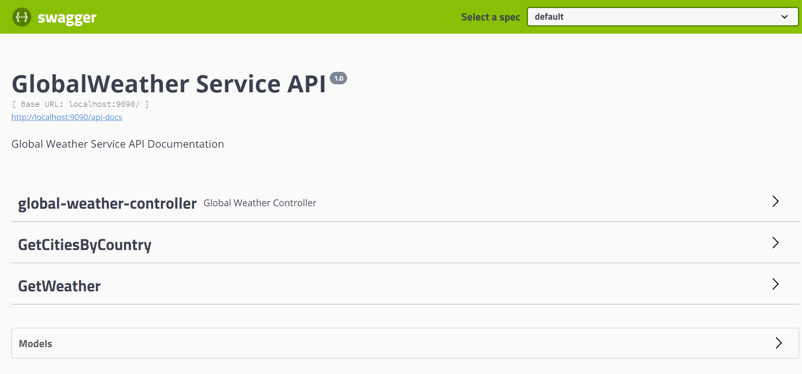

# GlobalWeather Service API

> Sample REST API build with Spring WebFlux

## Requirements

- Java 11
- Spring Boot 2.5.4
- WebFlux 2.5.4

## Installation

```bash
- git clone or download .zip file from this repository

- Open the project with IntelliJ IDEA

- Run node server.js to host the wsdl file locally at http://localhost:8080/GlobalWeather?wsdl

- Run the GlobalWeatherAPIProject project
```

## Usage

```bash
Now open your favorite web-browser (Chrome) and enter: http://localhost:9090/swagger-ui.html

Examples:

GetWeather: http://localhost:9090/getWeather/Australia/Melbourne

GetCitiesByCountry: http://localhost:9090/getCities/Australia

/api-docs - http://localhost:9090/api-docs

```


## Developed by
Albena Roshelova
